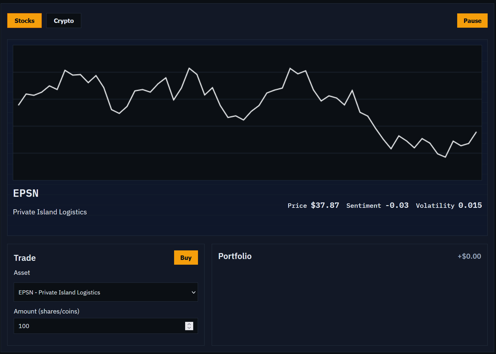
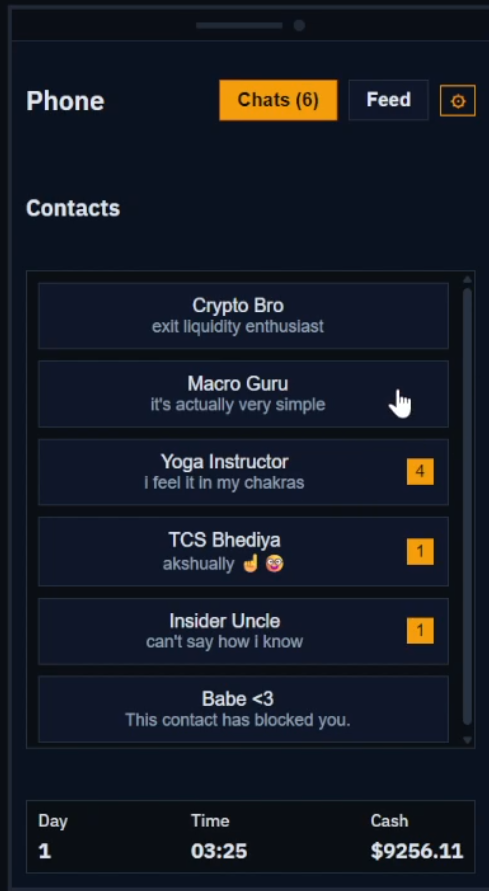
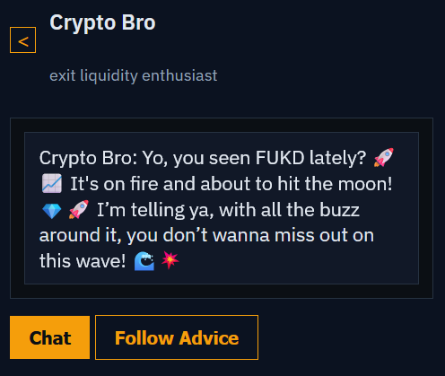

# Trust Me Bro
#### *play stupid games, win stupid prizes*

---

**Trust Me Bro** is a (bad) stock market simulation game where no one is your friend.

Your girlfriend just left you because you don't make enough money -- time to go for broke and win her back! Trade stocks and crypto, keep up with social media and news, and try to figure out if your contacts are giving you good advice or pulling a fast one on you. 

Built for Hawk-a-thoon '26. Currently password locked to limit API usage.

## How to Play

When you start a new game, you'll be greeted with your desktop showing a graph showing asset trajectory, a trade window, and your portfolio. Additionally, to the right, you'll find your phone, showing you your chat contacts and feed.

### Desktop

You can trade in both Stocks and Crypto here. Select different assets to view their trajectories.

**To buy an asset:**
1. Select the appropriate tab at the top of the window depending on what type of commodity you're trading
2. Go to the **Trade** window
3. Use the drop down to select which asset you wish to buy
4. Enter the quantity of the asset you wish to buy
5. Click Buy

**To sell an asset:**
1. Find the asset in your **Portfolio** window
2. Use the slider to select how much of it you wish to sell
3. Click Sell

### Phone

Your phone contains your **Contacts**. Each of your contact will periodically text you throughout the day, with useful information on the market. They may suggest to you that you buy or sell a particular asset. Their suggestions carry weight!

> [!WARNING]
> Your Contacts may be reliable sometimes, but *they each have their own hidden agendas!*
> 
> Occasionally, they may be trying out a scheme, to get you to buy or sell something which may hurt your portfolio.
> 
> **You must read their message and try to figure out if it's a scheme, or if they're for real.** Some are more trustworthy than others.

You may also click the "Chat" button in a Contact's chat to get a message from them on demand -- they're just as jobless as you are.

Furthermore, you can click the "Follow Advice" button to follow their advice. If the advice is to Buy, then by clicking this button you buy as much of the asset they're suggesting as the number that's entered into the "Amount" text bar of your Trade window.

---
Your phone also has your **Feed**, which gives you access to Social Media opinions, and the latest News on the market. Make sure to check back frequently and refresh your Feed to stay updated!

> [!NOTE]
> Events have an effect on the market, so act quick if you see something that affects your portfolio!

---

At the bottom of your phone screen, you can keep track of what Day it is, how much time you have remaining in the day, and how much cash you have outside of your investments.

You may pause the game at any time by clicking the Pause button. Note that you can't Buy or Sell anything while the game is paused.

Progress is saved at the end of every day, when daily living expenses are also collected. Don't put all your cash into the market!

In the Settings of your phone, you may quit to the Main Menu, which saves your progress, or reset your run, which basically starts a New game.

## Tech stack
Absolutely nothing impressive, just vanilla JS for the frontend and an OpenAI API call for the chats.
